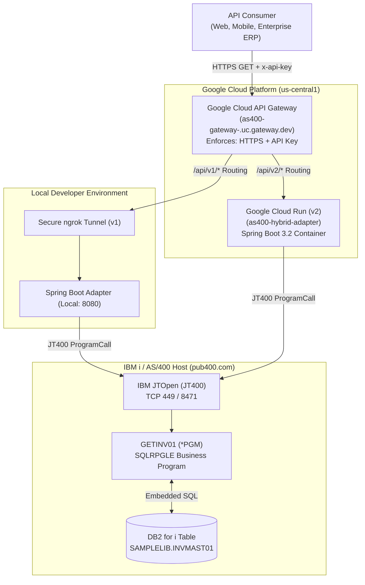

# AS/400 (IBM i) Hybrid Cloud Modernization PoC
### Case 1: API-Led Encapsulation Pattern

[](https://adoptium.net/)
[](https://spring.io/projects/spring-boot)
[](https://jt400.sourceforge.net/)
[](https://cloud.google.com/api-gateway)
[](https://cloud.google.com/run)
[](TEST_REPORT_E2E.md)

---

## 1. Executive Summary

This repository demonstrates an enterprise-grade proof of concept (PoC) for **modernizing legacy IBM i (AS/400) core systems** using the **API-Led Encapsulation Pattern**. 

Instead of undertaking high-risk, multi-year "rip-and-replace" migrations, this architecture encapsulates existing **RPG business programs** and **DB2 for i tables** behind a high-performance **Spring Boot 3.2 hybrid adapter** and a **Google Cloud API Gateway**. Cloud-native consumers interact with modern, secure, and authenticated RESTful JSON endpoints while preserving decades of proven legacy ledger business logic.

---

## 2. Problem Statement

Enterprises running mission-critical workloads on IBM i / AS/400 face significant modernization bottlenecks:

1. **Proprietary Protocol Barriers**: Legacy systems speak 5250 datastreams, EBCDIC encoding, packed decimal binary formats (`packed(11:2)`), and proprietary IBM AS/400 host server protocols (`as-netprt`, `as-rmtcmd`, `as-database` on TCP 8471/449). Modern cloud platforms, web clients, and SaaS partners cannot natively consume these protocols.
2. **High Risk of Rewriting**: Decades of institutional edge cases and calculation rules are embedded in RPG source (`SQLRPGLE`). Rewriting them from scratch introduces extreme financial and operational risk.
3. **Security and Governance Deficits**: Exposing AS/400 host ports directly to the internet is prohibited under standard enterprise compliance frameworks (PCI-DSS, SOC 2, ISO 27001).

**The Solution:** Encapsulate the IBM i program calls via an intermediate cloud-ready Java microservice using JTOpen (`JT400`), managed and authenticated at the perimeter by Google Cloud API Gateway.

---

## 3. Architecture Overview

### End-to-End Architectural Flow

The platform supports dual routing to facilitate both rapid local engineering and containerized cloud deployment:
- **v1 Route (`/api/v1/*`)**: Local development loop through an authenticated secure ngrok TLS tunnel.
- **v2 Route (`/api/v2/*`)**: Production target containerized on **Google Cloud Run**.



### Protocol & Data Transformation Matrix

| Stage | Input Format | Protocol | Output Format |
|---|---|---|---|
| **Consumer $\rightarrow$ Gateway** | JSON / Query Params | HTTPS (TLS 1.3) | Validated Request with Identity |
| **Gateway $\rightarrow$ Adapter** | REST (`/api/v2/invoices/getinvoice`) | HTTPS | Spring MVC `@RestController` |
| **Adapter $\rightarrow$ IBM i** | Java Object (`invId: "INV-1001"`) | JT400 Host Server (TCP 8471) | EBCDIC / Packed Decimal Buffer |
| **RPG Program $\rightarrow$ DB2** | `inInvId char(10)` | Native SQL Engine | Row retrieval from `INVMAST01` |
| **IBM i $\rightarrow$ Adapter** | Packed decimal bytes | JT400 ProgramCall return | `InvoiceResponse` DTO |
| **Adapter $\rightarrow$ Consumer** | Java DTO | HTTPS / JSON | Standard ISO REST Response |

---

## 4. Component Directory Guide

```text
enterprise-migration-lab/
├── as400-migration/
│   ├── legacy/
│   │   ├── schema.sql               # DB2 table DDL & seed records (INVMAST01)
│   │   └── GETINV01.SQLRPGLE        # Parameterized RPG business program (GETINV01 *PGM)
│   └── hybrid-adapter/
│       ├── Dockerfile               # Multi-stage container build (Alpine JDK 21 -> JRE 21)
│       ├── pom.xml                  # Spring Boot 3.2.4 + JTOpen JT400 + SpringDoc OpenAPI
│       └── src/
│           ├── main/
│           │   ├── java/.../adapter/
│           │   │   ├── config/      # IbmiProperties & Swagger OpenApiConfig
│           │   │   ├── controller/  # Dual-mapped REST endpoints (/api/v1 & /api/v2)
│           │   │   ├── dto/         # Strongly-typed InvoiceResponse data structures
│           │   │   └── service/     # IbmiInvoiceService (JT400 ProgramCall implementation)
│           │   └── resources/
│           │       └── application.yml # Dynamic property binding (${PORT}, ${PUB400_PASSWORD})
│           └── test/                # Unit & mock slice tests (WebMvcTest, packed decimal converter)
├── gcp-infrastructure/
│   ├── openapi-gateway-active.yaml  # OpenAPI 2.0 (Swagger) Gateway Spec with dual routing & API keys
│   ├── deploy-gateway.ps1 / .sh     # Automated GCP API Gateway deployment scripts
│   ├── deploy-cloudrun.ps1 / .sh    # Automated Cloud Run container build & deployment scripts
│   ├── start-tunnel.ps1             # Local ngrok tunnel orchestrator
│   └── test-e2e.ps1                 # Automated 11-step integration & verification test harness
├── sprints.md                       # Sprint tracking and progress log
├── TEST_REPORT_E2E.md               # Generated end-to-end verification report (100% pass)
└── README.md                        # Project documentation
```

---

## 5. Setup & Local Run Guide

### Prerequisites
- **Java Development Kit**: JDK 21+
- **Maven**: 3.9+ (or use included `./mvnw`)
- **IBM i Account**: Access to PUB400 or private IBM i partition
- **Google Cloud SDK**: `gcloud` CLI authenticated (for cloud deployment)

### 1. Configure IBM i Credentials
Set your PUB400 user password in your local environment. Do **not** hardcode credentials in source code:

```powershell
# Windows PowerShell
$env:PUB400_PASSWORD = "YourActualPub400Password"
```

```bash
# Linux / macOS
export PUB400_PASSWORD="YourActualPub400Password"
```

### 2. Build and Test the Adapter Locally
Run unit tests and verify the packed decimal converters:
```powershell
cd as400-migration/hybrid-adapter
.\mvnw.cmd clean test
```

### 3. Launch the Spring Boot Adapter
```powershell
.\mvnw.cmd spring-boot:run
```
The adapter boots on port `8080` (or the port specified by `$env:PORT`).

### 4. Interactive OpenAPI / Swagger UI
Once running, open your browser to explore the interactive OpenAPI schema:
- **Swagger UI**: [http://localhost:8080/swagger-ui/index.html](http://localhost:8080/swagger-ui/index.html)
- **OpenAPI v3 JSON**: [http://localhost:8080/v3/api-docs](http://localhost:8080/v3/api-docs)

---

## 6. Cloud Deployment & API Verification

### Active Deployment Endpoints
- **Perimeter Gateway**: `https://as400-gateway-<gateway-hash>.uc.gateway.dev`
- **Cloud Run Backend Service**: `https://as400-hybrid-adapter-<hash>-uc.a.run.app`

### Sample Request: Query Specific Invoice
Query invoice `INV-1001` via Google API Gateway:

```bash
curl -X GET "https://as400-gateway-<gateway-hash>.uc.gateway.dev/api/v2/invoices/getinvoice?invId=INV-1001" \
  -H "x-api-key: YOUR_GCP_API_KEY"
```

> [!IMPORTANT]
> **Header-Only Authentication**: For enterprise security, API keys are strictly passed via the `x-api-key` HTTP request header and not in query parameters, preventing credentials from leaking into web server access logs, proxies, or browser histories.

#### Expected 200 OK Response (Host Online):
```json
{
  "duDate": 20261115,
  "custNo": 100001,
  "invAmt": 1250.00,
  "status": "O",
  "found": "Y"
}
```

#### Expected 503 Response (Upstream Maintenance / Host Offline):
```json
{
  "timestamp": "2026-10-09T20:20:10.027780991Z",
  "status": 503,
  "error": "Service Unavailable",
  "fault": "UPSTREAM_LEGACY_HOST",
  "message": "Cannot reach the host: Upstream IBM i (AS/400) server is offline or undergoing scheduled maintenance.",
  "infrastructureStatus": {
    "gcpApiGateway": "HEALTHY",
    "gcpCloudRun": "HEALTHY",
    "upstreamIbmI": "UNREACHABLE"
  },
  "invoiceId": "INV-1001",
  "advisory": "GCP perimeter and application services are operational. Check upstream AS/400 host status."
}
```

### Sample Request: Overdue Summary Aggregation
```bash
curl -X GET "https://as400-gateway-<gateway-hash>.uc.gateway.dev/api/v2/invoices/overdue-summary" \
  -H "x-api-key: YOUR_GCP_API_KEY"
```

#### Expected 200 OK Response:
```json
{
  "status": "SUCCESS",
  "backend": "AS400-DB2-INVMAST01",
  "overdueCount": 2,
  "totalOverdueAmount": 3920.75,
  "asOfDate": 20261007,
  "overdueInvoices": [
    "INV-1003",
    "INV-1004"
  ]
}
```

### Running the End-to-End Test Suite
Run the automated test harness to validate all security rules, DB2 records (`INV-1001`–`INV-1004`), 404 handling, and latency:

```powershell
.\gcp-infrastructure\test-e2e.ps1 -ApiKey "YOUR_GCP_API_KEY"
```

*(See [TEST_REPORT_E2E.md](TEST_REPORT_E2E.md) for the verified 12/12 passing test run).*

---

## 7. Roadmap & Next Steps

### Sprint 1: Foundation & Cloud Modernization PoC (Completed)
- **Sprint 1.0**: Initialize workspace directory structure & development environment in VS Code.
- **Sprint 1.1**: Setup PUB400 IBM i library & seed synthetic `INVOICE_MASTER` DB2 table.
- **Sprint 1.2**: Author & compile parameter-aware RPG business logic (`INVCALC.rpgle` / `GETINV01`) on PUB400.
- **Sprint 1.3**: Build Spring Boot hybrid adapter service with JTOpen (JT400) binary `ProgramCall` mapping to REST.
- **Sprint 1.4**: Configure secure local development ingress tunnel (ngrok) and OpenAPI 2.0 specification.
- **Sprint 1.5**: Deploy Google Cloud API Gateway with API key perimeter authentication.
- **Sprint 1.5b**: Deploy containerized Spring Boot adapter to Google Cloud Run as `/v2` production target.
- **Sprint 1.6**: End-to-end integration test harness & DB2 state verification (100% success rate).
- **Sprint 1.6b**: Production documentation, sanitization, and Git/GitHub repository baseline.
- **Sprint 1.7**: *(In Progress)* Executive & technical presentation video walk-through.

### Sprint 2: Enterprise Security & Upstream Resilience Hardening (Active)
- **Sprint 2.0** `[Completed]`: Upstream maintenance & fail-fast 503 handling with fault attribution (`UPSTREAM_LEGACY_HOST`).
- **Sprint 2.1** `[Completed]`: Enforce HTTP header-only API key security (`x-api-key`), stripping query parameter exposure across OpenAPI contract and E2E harness.
- **Sprint 2.2** `[Next / In Progress]`: Lock down Cloud Run perimeter with IAM Service-to-Service authentication (`--no-allow-unauthenticated` + API Gateway service account OIDC invoker).
- **Sprint 2.3**: Store and rotate IBM i credentials using Google Cloud Secret Manager.
- **Sprint 2.4**: Enterprise connection pooling (`AS400ConnectionPool`) & Cloud Run workload capping to protect legacy host resources.
- **Sprint 2.5**: Upstream fault tolerance & circuit breaking via Resilience4j to avoid cascading failures during PUB400 maintenance.

### Future Architecture Roadmap
- **Phase 3 - Stored Procedure Wrapping**:
  - Wrap legacy RPG programs into **DB2 Stored Procedures** (`CREATE PROCEDURE ... EXTERNAL NAME ... GENERAL`).
  - Enable standardized JDBC callable statements as an alternative to JT400 binary `ProgramCall`.
- **Phase 4 - Asynchronous Event-Driven Ingestion**:
  - Implement change-data-capture (CDC) on DB2 journal receivers (`JRNRCV`) via Google Cloud Pub/Sub to trigger real-time downstream cloud events.
- **Phase 5 - Zero-Trust VPC Service Controls**:
  - Establish dedicated Cloud Interconnect / Cloud VPN tunnel between Google Cloud VPC and on-premise IBM Power Systems, eliminating public IP exposure.

---

## 8. Governance, Privacy & Compliance Notice

> [!NOTE]
> **Synthetic Data & Clean-Room Development:**
> All database schemas (`INVMAST01`), business logic programs (`GETINV01`), and test fixtures in this repository are 100% synthetic, developed independently from scratch on the public IBM i educational system ([PUB400](https://pub400.com)). 
> **No proprietary code, production customer data, or intellectual property from any current or prior employer was used or referenced.** All runtime secrets and credentials are isolated through dynamic environment variables and strictly excluded from version control.

